# Regex Engine - Java Implementation

[](https://app.codecrafters.io/users/codecrafters-bot?r=2qF)
[](https://github.com/your-username/codecrafters-grep-java)
[](https://openjdk.java.net/)
[](https://maven.apache.org/)
[](LICENSE)

A custom regular expression engine built from scratch in Java, featuring a modular pattern-based architecture and comprehensive regex syntax support. This project was developed as part of the [CodeCrafters "Build Your Own grep" Challenge](https://app.codecrafters.io/courses/grep/overview).

## ✨ Features

### Supported Regex Patterns
- **Literal characters** - Exact character matching
- **Wildcard** (`.`) - Matches any single character
- **Character classes**:
  - `\d` - Digits (0-9)
  - `\w` - Word characters (alphanumeric + underscore)
- **Character groups** (`[abc]`, `[^abc]`) - Custom character sets
- **Quantifiers**:
  - `+` - One or more occurrences
  - `?` - Zero or one occurrence
- **Anchors**:
  - `^` - Start of string
  - `$` - End of string
- **Alternation** (`|`) - OR logic with grouping support
- **Grouping** (`()`) - Pattern grouping and precedence

### Architecture Highlights
- **Pattern Factory Design** - Clean separation of parsing and execution
- **Modular Pattern System** - Each regex feature implemented as separate classes
- **Extensible Design** - Easy to add new pattern types
- **Robust Error Handling** - Graceful handling of malformed patterns

## 🏗️ Architecture

The regex engine follows a clean, object-oriented design:

```
PatternFactory → Creates appropriate PatternMatcher instances
PatternMatcher → Interface for all pattern matching operations
Pattern Classes → Individual implementations for each regex feature
```

### Core Components

| Component | Purpose |
|-----------|---------|
| `PatternFactory` | Parses regex strings and creates pattern objects |
| `PatternMatcher` | Interface defining matching operations |
| `SequencePattern` | Handles sequential pattern matching |
| `AlternationPattern` | Implements OR logic (`\|`) |
| `QuantifierPattern` | Base for `+`, `?` quantifiers |
| `AnchorPattern` | Implements `^` and `$` anchors |

## 🚀 Getting Started

### Prerequisites
- Java 21 or higher
- Maven 3.6+

### Building the Project

```bash
# Clone from GitHub
git clone https://github.com/your-username/codecrafters-grep-java.git
cd codecrafters-grep-java

# Or clone from CodeCrafters
git clone https://git.codecrafters.io/your-username/grep-challenge.git
cd grep-challenge

# Compile and package
mvn package

# Run the grep implementation
./your_program.sh -E "<pattern>"
```

### Usage Examples

```bash
# Match literal characters
echo "hello" | ./your_program.sh -E "hello"

# Use wildcards
echo "cat" | ./your_program.sh -E "c.t"

# Character classes
echo "123" | ./your_program.sh -E "\d+"

# Anchors
echo "start" | ./your_program.sh -E "^start"

# Alternation
echo "cat" | ./your_program.sh -E "(cat|dog)"
```

## 🛠️ Development

### Project Structure
```
src/main/java/
├── Main.java                    # Entry point
├── PatternFactory.java         # Pattern creation and parsing
├── PatternMatcher.java         # Core matching interface
├── SequencePattern.java        # Sequential pattern matching
├── AlternationPattern.java     # OR logic implementation
├── *Pattern.java              # Individual pattern implementations
└── MatchResult.java           # Result utilities
```

### Key Design Patterns
- **Factory Pattern** - `PatternFactory` for object creation
- **Strategy Pattern** - Different matching strategies via `PatternMatcher`
- **Composite Pattern** - Complex patterns built from simpler ones

## 🧪 Testing

The implementation includes comprehensive error handling and supports all standard regex features expected in a grep-like tool.

## � Technical Deep Dive

### Regex Processing Flow

For developers interested in understanding the internal workings of the regex engine, here's the detailed processing flow:

```mermaid
flowchart TD
    %% Input and Main Flow
    A[Input: Regex Pattern & Text] --> B[Main.run]
    B --> C[PatternFactory.createPattern]
    
    %% Anchor Checking
    C --> D{Check for Anchors<br/>^ or $?}
    D -->|Yes| E[Wrap with<br/>Anchor Patterns]
    D -->|No| F[Parse Core Pattern]
    E --> F
    
    %% Core Parsing
    F --> G[parsePattern Method]
    G --> H[Parse Elements<br/>with Quantifiers]
    
    %% Element Type Classification
    H --> I{Identify<br/>Element Type}
    I -->|Literal Character| J[LiteralCharacterPattern]
    I -->|Wildcard '.'| K[AnyCharacterPattern]
    I -->|Escape Sequence<br/>\d, \w, etc.| L[DigitClass/<br/>WordClass Pattern]
    I -->|Character Group<br/>bracket notation| M[CharacterGroupPattern]
    I -->|Parentheses Group<br/>grouping| N{Group Contains<br/>Alternation?}
    
    %% Group Processing
    N -->|Yes| O[AlternationPattern]
    N -->|No| P[Nested Pattern]
    
    %% Quantifier Processing
    J --> Q{Apply<br/>Quantifier?}
    K --> Q
    L --> Q
    M --> Q
    O --> Q
    P --> Q
    
    Q -->|+ modifier| R[OneOrMorePattern]
    Q -->|? modifier| S[ZeroOrOnePattern]
    Q -->|No quantifier| T[Base Pattern]
    
    %% Sequence Building
    R --> U[Add to Sequence]
    S --> U
    T --> U
    
    U --> V{More Elements<br/>to Process?}
    V -->|Yes| H
    V -->|No| W[Create Final Pattern]
    
    %% Final Pattern Creation
    W --> X{Single Element<br/>Pattern?}
    X -->|Yes| Y[Return Element<br/>Directly]
    X -->|No| Z[Create<br/>SequencePattern]
    
    %% Pattern Matching Phase
    Y --> AA[Begin Pattern<br/>Matching]
    Z --> AA
    AA --> BB[Execute pattern.matches]
    BB --> CC{Match Found?}
    
    %% Results
    CC -->|Yes| DD[✓ Exit Code 0<br/>Success]
    CC -->|No| EE[✗ Exit Code 1<br/>No Match]
    
    %% Styling
    classDef inputStyle fill:#e3f2fd,stroke:#1976d2,stroke-width:2px,color:#0d47a1
    classDef processStyle fill:#f3e5f5,stroke:#7b1fa2,stroke-width:2px,color:#4a148c
    classDef patternStyle fill:#fff3e0,stroke:#f57c00,stroke-width:2px,color:#e65100
    classDef decisionStyle fill:#f1f8e9,stroke:#388e3c,stroke-width:2px,color:#1b5e20
    classDef successStyle fill:#e8f5e8,stroke:#4caf50,stroke-width:3px,color:#2e7d32
    classDef errorStyle fill:#ffebee,stroke:#f44336,stroke-width:3px,color:#c62828
    
    class A inputStyle
    class B,C,F,G,H,W,AA,BB processStyle
    class J,K,L,M,O,P,R,S,T,Y,Z patternStyle
    class D,I,N,Q,V,X,CC decisionStyle
    class DD successStyle
    class EE errorStyle
```



## �📚 Learning Outcomes

This project demonstrates:
- **Regex Engine Internals** - How regular expressions are parsed and executed
- **Parser Design** - Building a recursive descent parser for regex syntax
- **Object-Oriented Design** - Clean separation of concerns and extensible architecture
- **Java Best Practices** - Modern Java features and coding patterns

## 🤝 About CodeCrafters

This project was built as part of the ["Build Your Own grep" Challenge](https://app.codecrafters.io/courses/grep/overview) on CodeCrafters, where developers build their own versions of popular developer tools from scratch.

## � Repository Information

This repository is maintained in two locations:
- **GitHub**: [github.com/your-username/codecrafters-grep-java](https://github.com/your-username/codecrafters-grep-java) - Public repository for portfolio and collaboration
- **CodeCrafters**: Private repository maintaining challenge progress and submissions

Both repositories are kept in sync to preserve the complete development history while providing public access to the implementation.

## �📄 License

This project is part of a coding challenge and is intended for educational purposes.
